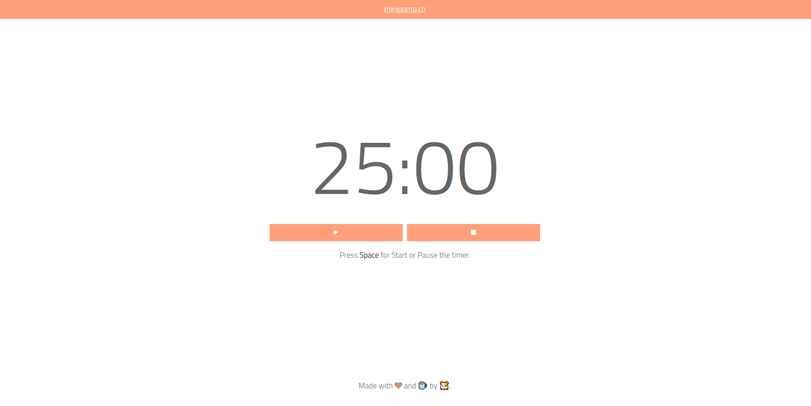

# minimalist-pomodoro
A 🍅 Pomodoro Timer 🍅 built with jQuery, Bootstrap 3 and Notify.js.



---

## Installation

Clone the repo `git clone https://github.com/MattLdwig/minimalist-pomodoro.git`

Open **index.html**

---

## How it works

Use your `space` key or the  to start .

Press ⏹ to stop and reset.

The default time values can be customized by changing the values of:

```
const defaultFocus = 25 * 60,
			defautShortBreak = 5 * 60,
			defaultLongBreak = 15 * 60;
```

at the top of the `app.js` file.

### License

This application is [licensed as MIT](License.md). 


